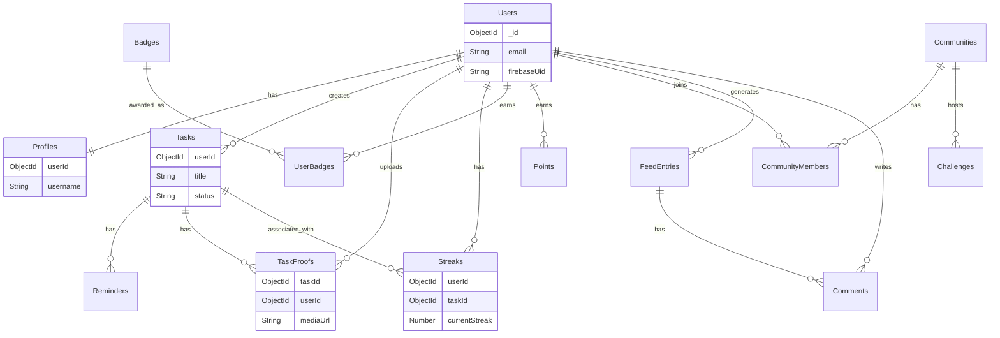

## ER Diagram

```mermaid
erDiagram
    Users ||--|| Profiles : has
    Users ||--o{ Tasks : creates
    Tasks ||--o{ Reminders : has
    Tasks ||--o{ TaskProofs : has
    Users ||--o{ TaskProofs : uploads
    Users ||--o{ Streaks : has
    Tasks ||--o{ Streaks : associated_with
    Users ||--o{ UserBadges : earns
    Badges ||--o{ UserBadges : awarded_as
    Users ||--o{ Points : earns
    Users ||--o{ CommunityMembers : joins
    Communities ||--o{ CommunityMembers : has
    Communities ||--o{ Challenges : hosts
    Users ||--o{ FeedEntries : generates
    FeedEntries ||--o{ Comments : has
    Users ||--o{ Comments : writes

    Users {
        ObjectId _id
        String email
        String firebaseUid
    }
    Profiles {
        ObjectId userId
        String username
    }
    Tasks {
        ObjectId userId
        String title
        String status
    }
    TaskProofs {
        ObjectId taskId
        ObjectId userId
        String mediaUrl
    }
    Streaks {
        ObjectId userId
        ObjectId taskId
        Number currentStreak
    }
```
